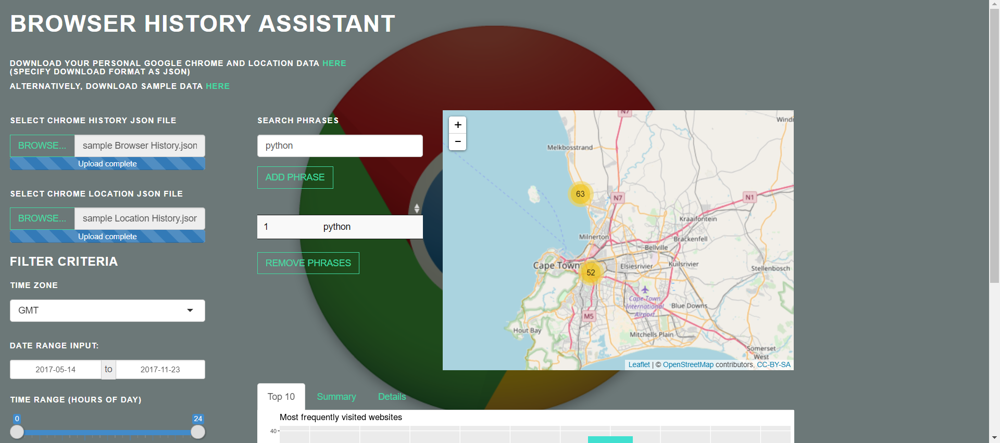
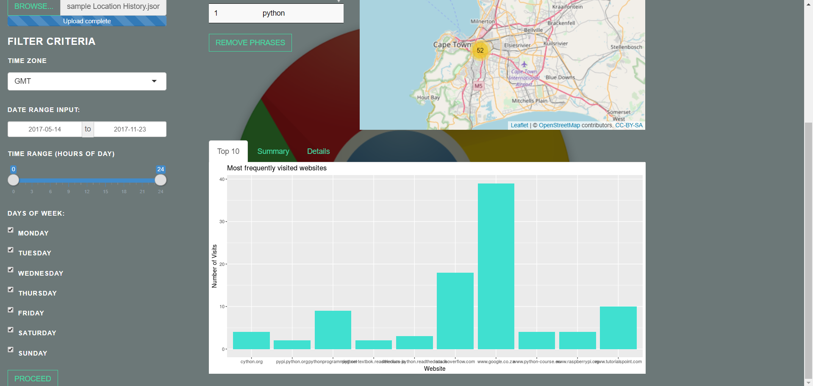

# Google Chrome History Assistant

**Created by:** Johannes Harmse

## Overview

The purpose of the app is to help users analyze and extract information from their Google Chrome history by more intuitive filtering features and visualizations. One of the main advantages of this app over trying to decipher a list of historical browser links, is the linking of web browsing to physical locations using Google location data.

The app can be viewed and used [here](https://johannesapps.shinyapps.io/google_chrome_history_assistant/).

## Features

The main layout of the app is shown below.

